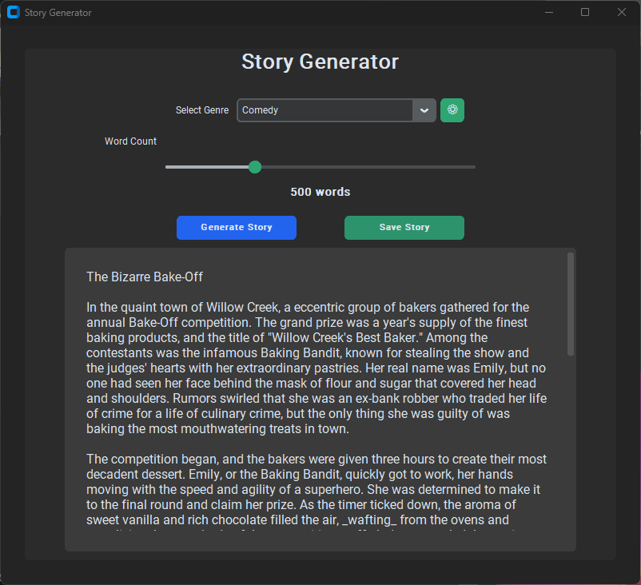

# Story Generator

A desktop application that generates creative stories using AI. Choose from various genres, set your desired word count, and get unique stories with proper formatting including bold text, italics, and paragraph breaks.



## Features

- 30+ story genres including Horror, Fantasy, Science Fiction, Romance, and many more
- Customizable genre list - add, remove, and manage your own genres
- Adjustable word count (100-1500 words) with 10-word increments
- Stories formatted with **bold** emphasis and *italic* text for thoughts/sounds
- Proper paragraph breaks for easy reading
- Save generated stories in multiple formats: Markdown, RTF, DOCX, Text, or PDF
- Vertical scrollbars in the story area when needed
- Dark-themed modern UI with compact controls

## Story Variety

To ensure each generated story is unique and creative, the application uses advanced AI parameters:

- **High Temperature Setting**: Configured at 1.2 for more imaginative and varied story outputs
- **Random Seeds**: Each generation request includes a unique random seed, which helps the AI model produce different results even with similar prompts

This combination helps prevent repetitive stories and provides fresh, original content each time you generate a new story.

## Prerequisites

- Python 3.8 or higher
- A free Groq API key

## Getting Your Free Groq API Key

1. Visit [https://console.groq.com/keys](https://console.groq.com/keys)
2. Sign up for a free account (no credit card required)
3. Click "Create API Key"
4. Copy your API key
5. Open `api_key.json` in this project folder
6. Replace the placeholder with your actual API key:
   ```json
   {"api_key": "your_groq_api_key_here"}
   ```

Groq offers free access to powerful language models with generous rate limits, perfect for this story generator.

## Installation

1. Clone or download this repository
2. Create a virtual environment (recommended):
   
   **Windows (PowerShell):**
   ```powershell
   python -m venv .venv
   .\.venv\Scripts\Activate.ps1
   ```
   
   **macOS/Linux:**
   ```bash
   python3 -m venv .venv
   source .venv/bin/activate
   ```

3. Install required packages:
   ```bash
   pip install -r requirements.txt
   ```
   
   Or manually:
   ```bash
   pip install customtkinter requests python-docx reportlab
   ```
4. Add your Groq API key to `api_key.json` (see above)

## Usage

1. Activate the virtual environment (if using one):
   
   **Windows (PowerShell):**
   ```powershell
   .\.venv\Scripts\Activate.ps1
   ```
   
   **macOS/Linux:**
   ```bash
   source .venv/bin/activate
   ```

2. Run the application:
   
   **Windows:**
   ```powershell
   py main.pyw
   ```
   
   **macOS/Linux:**
   ```bash
   python3 main.pyw
   ```

3. Select a genre from the dropdown
4. Adjust the word count slider (increments of 10)
5. Click "Generate Story"
6. Optionally save the story in your preferred format (Markdown, RTF, DOCX, Text, or PDF)

## Files

- `main.pyw` - Main application file
- `api_key.json` - Store your Groq API key here
- `genres.json` - Customizable list of story genres
- `requirements.txt` - Python dependencies
- `LICENSE` - MIT license file
- `README.md` - This file
- `screenshot.png` - Application screenshot

## Technologies Used

- **customtkinter** - Modern UI framework for Python
- **requests** - HTTP library for API calls
- **python-docx** - Library for creating DOCX files
- **reportlab** - Library for generating PDF files
- **Groq API** - Fast, free AI inference using Llama 3.3 70B model
- **Python 3** - Core programming language

## License

MIT License

Copyright (c) 2024 QuantumPixelator

Permission is hereby granted, free of charge, to any person obtaining a copy
of this software and associated documentation files (the "Software"), to deal
in the Software without restriction, including without limitation the rights
to use, copy, modify, merge, publish, distribute, sublicense, and/or sell
copies of the Software, and to permit persons to whom the Software is
furnished to do so, subject to the following conditions:

The above copyright notice and this permission notice shall be included in all
copies or substantial portions of the Software.

THE SOFTWARE IS PROVIDED "AS IS", WITHOUT WARRANTY OF ANY KIND, EXPRESS OR
IMPLIED, INCLUDING BUT NOT LIMITED TO THE WARRANTIES OF MERCHANTABILITY,
FITNESS FOR A PARTICULAR PURPOSE AND NONINFRINGEMENT. IN NO EVENT SHALL THE
AUTHORS OR COPYRIGHT HOLDERS BE LIABLE FOR ANY CLAIM, DAMAGES OR OTHER
LIABILITY, WHETHER IN AN ACTION OF CONTRACT, TORT OR OTHERWISE, ARISING FROM,
OUT OF OR IN CONNECTION WITH THE SOFTWARE OR THE USE OR OTHER DEALINGS IN THE
SOFTWARE.
